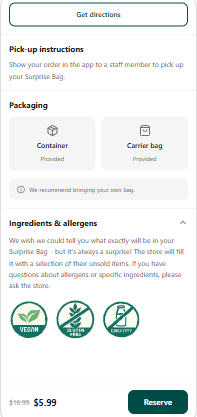

# Too Good To Go Clone

> Pixel-perfect desktop clone of Too Good To Go with a custom dietary restriction badge feature for surprise bag transparency.



**Live:** [toogoodtogo.netlify.app](https://toogoodtogo.netlify.app/)

## The Problem

Too Good To Go sells surplus food as "surprise bags" at a discount, but users with dietary restrictions (vegan, gluten-free, nut-free, halal, kosher) have no way to preview what's inside before purchasing. For the 32 million Americans with food allergies, buying a mystery bag is a gamble. Stores already disclose allergen info under NYC Health Code §81.49, but the app doesn't surface it.

## What It Does

Users browse store listings with color-coded dietary badges (vegan, gluten-free, dairy-free, etc.) visible on each card. A filter on the browse view lets users narrow results to stores matching their restrictions. The feature is designed on top of a pixel-perfect desktop clone of the real Too Good To Go interface.

## Key Features

| Feature | Description |
| --- | --- |
| Pixel-Perfect Clone | Desktop recreation of Too Good To Go's browse, store detail, and checkout UI |
| Dietary Badges | Color-coded labels (vegan, gluten-free, nut-free, halal, kosher) on each store listing |
| Dietary Filters | Filter the browse view to show only stores matching selected dietary needs |
| Store Detail View | Expanded store info with surprise bag contents preview and dietary info |
| Responsive Layout | Mobile-first design adapted to desktop viewport |

## Tech Stack

| Layer | Tech | Why |
| --- | --- | --- |
| Frontend | React, Vite | Component-based architecture for reusable store cards and badge components |
| Styling | Tailwind CSS | Utility classes matched the pixel-perfect clone workflow, rapid iteration on spacing and color |
| Persistence | localStorage | No backend needed for a clone focused on frontend fidelity |

## Technical Decisions

- **Dietary badges scoped to existing disclosure data over user-submitted tags** — NYC Health Code §81.49 already requires allergen disclosure, so the feature is grounded in data restaurants already provide rather than crowdsourced info that could be inaccurate and create liability.
- **Desktop-first clone over mobile-first** — Too Good To Go is a mobile app, but cloning it at desktop scale forced us to make deliberate layout decisions about how mobile patterns (bottom nav, card stacks, swipe gestures) translate to wider viewports.

## Getting Started

```bash
git clone https://github.com/jonelrichardson-spec/toogoodtogo.git
cd toogoodtogo
npm install
npm run dev
```

## What I'd Build Next

- Backend integration with store menu APIs to pull real allergen data
- User dietary profiles that persist preferences across sessions
- Surprise bag contents prediction using historical store data

## About This Project

Built during Pursuit's AI-Native Builder Fellowship (February 2026) with teammate Victor.

My role: Led the pixel-perfect clone build — recreated the full Too Good To Go UI from the original app. Victor designed and implemented the dietary restriction badge system.

---

Built by [Jonel Richardson](https://linkedin.com/in/jonel-richardson-09a399382)
